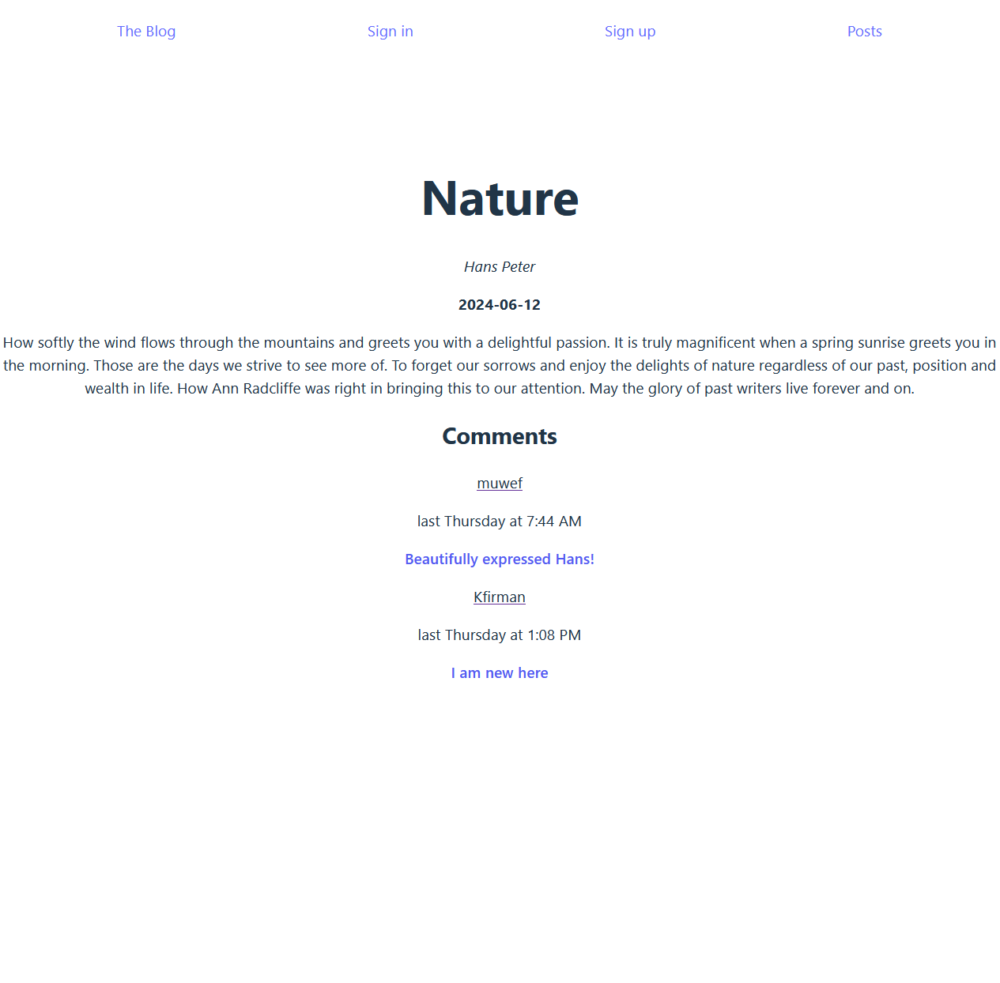

# A blog

This project is build using a React frontend and backend using Express, NodeJS + MongoDB. User authentication is handled via a local strategy with Passport.js. JSON Web Tokens are used to protect routes within the applications. Users that are not an author can not sign in to the admin page and post/edit any of the blogs. Users can add comments to posts.

## The Odin Project: Lesson Blog API

The project is build according to the specification of the [Blog API lesson](https://www.theodinproject.com/lessons/nodejs-blog-api)

Project uses minimal CSS as the focus of the project is building an API backend with Express, NodeJS and MongoDB.

## Live website

The user frontend is for users to read the blog and place comments if logged in:
<a href='https://main--blog-api-user-frontend.netlify.app/'>User frontend of The Blog</a>

The author/admin frontend is for authors to write and publish/unpublish posts and delete comments if necessary. Only authors can login here.
<a href='https://main--blog-admin-frontend-odin.netlify.app/'>Author frontend of The Blog</a>
